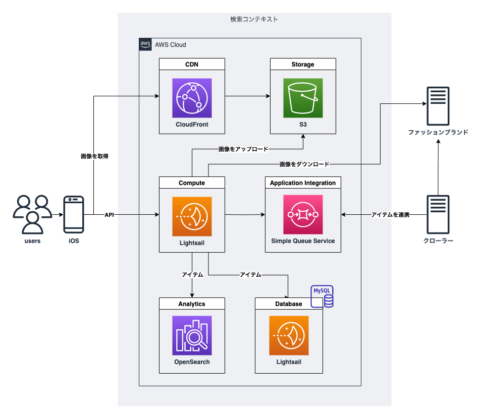
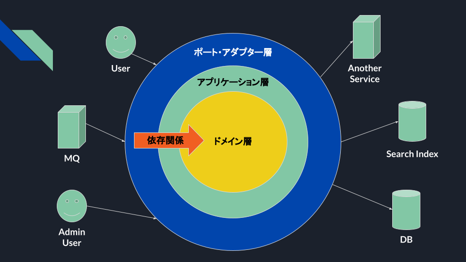

# Greeedy
ファッションアイテムに特化した検索エンジン「Greeedy」

## Structure
<details><summary>システム構成</summary>

本システムは、ファッションブランドとファッションアイテムの管理と検索を可能にするためのコンテキストです。
検索エンジンには、Amazon Opensearch Serviceを採用し、データベースには[PlanetScale](https://planetscale.com)のMySQLを採用しています。



 - [Amazon ECR](https://ap-northeast-1.console.aws.amazon.com/ecr/repositories/private/684886458640/greeedy?region=ap-northeast-1)
 - [API Gateway](https://ap-northeast-1.console.aws.amazon.com/apigateway/home?region=ap-northeast-1#/apis/nagpu8j4w7/resources)
 - [lambda-greeedy - Lambda](https://ap-northeast-1.console.aws.amazon.com/lambda/home?region=ap-northeast-1#/functions/lambda-greeedy?tab=code)

</details>

<details><summary>アーキテクチャとパッケージ構成</summary>

このアプリケーションのアーキテクチャには、エンドユーザー、管理ユーザー、外部コンテキストとAPIやMQなど様々な入出力方法を用いてやりとりするため、
ヘキサゴナルアーキテクチャ(ポートアンドアダプター)を採用しています。 
このアーキテクチャは、外部と対話するポートとアダプターを容易に追加したり、変更しやすいうえにテストもしやすい特徴があります。



パッケージ構成は以下の通りです。

```shell
app
├── application  # アプリケーション層
├── config  # 設定パッケージ
├── di  # DIパッケージ
├── domain  # ドメイン層
│   └── model
├── exception  # 例外パッケージ
└── port
    └── adapter  # ポート・アダプター層
```

</details>

## How to

<details><summary>起動方法</summary>

```bash
$ cd ~/path/to/greeedy

# .envファイルをコピーして、適切な値に書き換える
$ cp ./elasticsearch/.env.sample ./elasticsearch/.env

# コンテナの起動
$ docker-compose up --build

$ docker-compose run --rm \
  -p 8000:8000 \
  app \
  uvicorn start_api:api --host 0.0.0.0 --reload

$ mysql -h 127.0.0.1 -P 3306 -u user -p
```

 - [Greeedy API - Swagger UI](http://0.0.0.0:8000/docs)
 - [Opensearch](http://0.0.0.0:9200)
 - [Opensearch - dashbord]()
 - [MySQL]()

</details>

<details><summary>UT実行方法</summary>

```bash
$ pytest -v .
```

</details>

<details><summary>デプロイ手順</summary>

```bash
# Amazon ECRにDockerイメージをプッシュ
$ sh build_and_push.sh lambda-greeedy
```
</details>